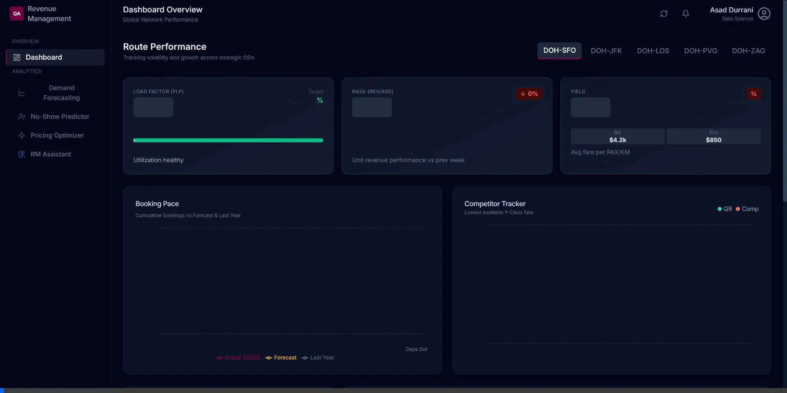
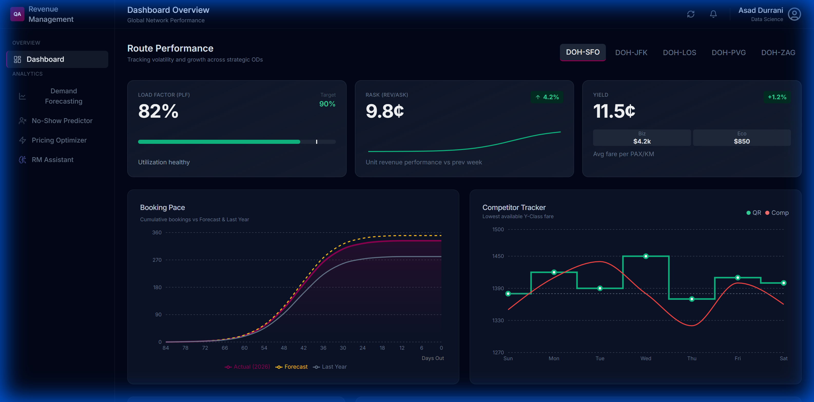
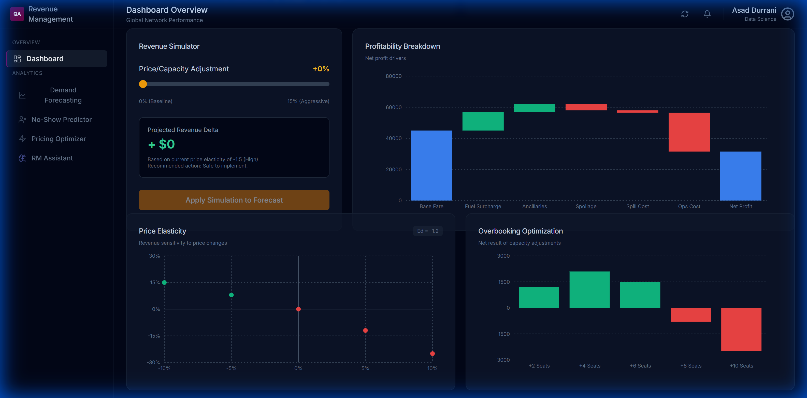
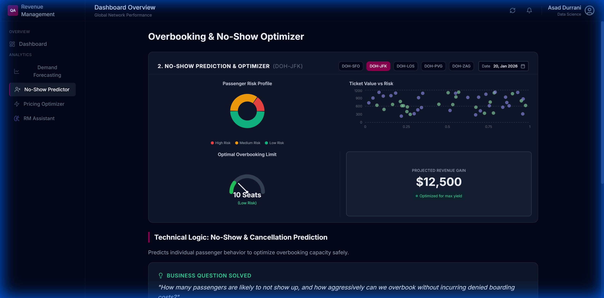
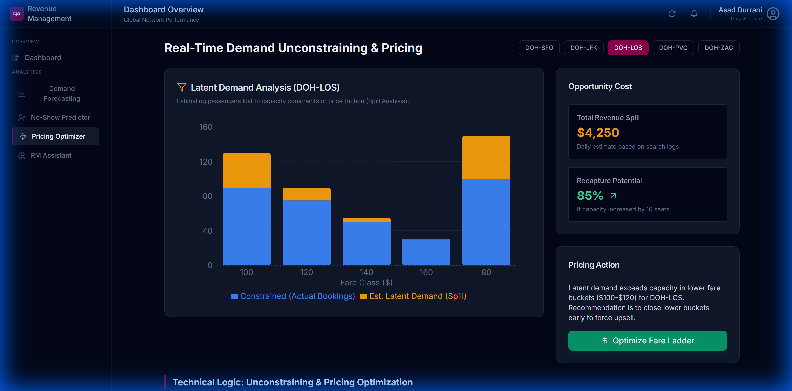
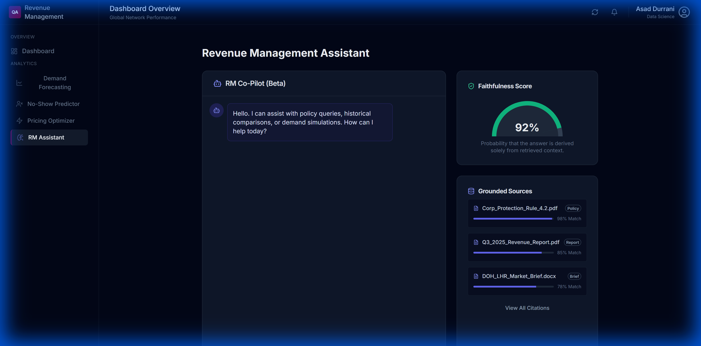

# HeyGen Demo Script Walkthrough
## Qatar Airways Revenue Management Dashboard

This document provides a visual walkthrough of the interactive dashboard used in the HeyGen demo script.

---

## 📺 Dashboard Visual Tour Recording

A recorded tour of the dashboard navigation:

---

## 📸 Dashboard Screenshots

### 1. Strategic Dashboard (Top) - Opening Hook

**Key Visuals:**
- **KPI Cards**: Load Factor (82%), RASK (9.8¢), Yield (11.5¢) with trend indicators
- **Route Selector**: DOH-SFO, DOH-JFK, DOH-LOS, DOH-PVG, DOH-ZAG
- **Booking Pace Chart**: Actual vs Forecast vs Last Year comparison
- **Competitor Tracker**: Qatar Airways vs Primary Competitor pricing

---

### 2. Strategic Dashboard (Bottom) - Revenue Simulator

**Key Visuals:**
- **Revenue Simulator**: Price/Capacity adjustment slider (0-15%)
- **Projected Revenue Delta**: Shows calculated uplift
- **"Apply Simulation" Button**: Interactive action with loading state
- **Profitability Breakdown**: Waterfall chart showing net profit drivers
- **Price Elasticity**: Scatter plot showing revenue sensitivity
- **Overbooking Optimization**: Bar chart for capacity adjustments

---

### 3. No-Show Predictor - Problem #2

**Key Visuals:**
- **Passenger Risk Profile**: Pie chart showing risk segments (Low/Medium/High)
- **Ticket Value vs Risk**: Scatter plot correlating value with no-show probability
- **Optimal Overbooking Limit**: Gauge showing "10 Seats (Low Risk)"
- **Projected Revenue Gain**: $12,500 display card

---

### 4. Pricing Optimizer - Problem #3

**Key Visuals:**
- **Latent Demand Analysis**: Stacked bar chart (Blue = Bookings, Orange = Spill)
- **Opportunity Cost Card**: $4,250 Total Revenue Spill
- **Recapture Potential**: 85% with arrow indicator
- **"Optimize Fare Ladder" Button**: Interactive action with success toast

---

### 5. RM Assistant - AI Trust

**Key Visuals:**
- **Chat Interface**: RM Co-Pilot (Beta) with sample conversation
- **Faithfulness Score Gauge**: 92% showing high grounding
- **Grounded Sources Panel**: Document citations with match percentages
- **Processing Indicators**: "Retrieving documents..." / "Generating response..."

---

## 📝 Script Location

The complete 5-minute HeyGen script is located at:
- [HEYGEN_DEMO_SCRIPT.md](./HEYGEN_DEMO_SCRIPT.md)

---

## ✅ Verification Summary

| Component           | Status    | Notes                                    |
| ------------------- | --------- | ---------------------------------------- |
| Strategic Dashboard | ✅ Working | All KPIs and charts render correctly     |
| Revenue Simulator   | ✅ Working | Slider and Apply Simulation functional   |
| No-Show Predictor   | ✅ Working | Pie, scatter, and gauge render data      |
| Pricing Optimizer   | ✅ Working | Bar chart and Optimize button functional |
| RM Assistant        | ✅ Working | Chat, faithfulness, and sources display  |
| Navigation          | ✅ Working | Sidebar links navigate between views     |

---

## 🎬 Recording Instructions

1. **Start Dashboard**: `npm run dev` in `d:\AirlineDashboard`
2. **Open Browser**: Navigate to `http://localhost:3000/`
3. **Set Up HeyGen**: Use screen recording overlay mode
4. **Follow Script**: Execute each section timing as outlined in the script
5. **Capture Actions**: Ensure button clicks are visible during recording

---

*Created for Qatar Airways Data Science Manager Interview Demo*
